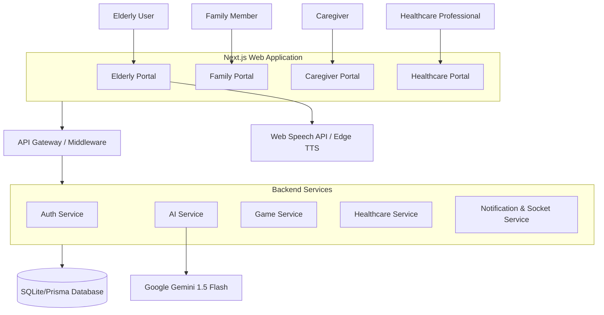

# Sahayak AI Architecture

Sahayak AI is built as a modern, decoupled microservices-inspired monolithic application optimized for elderly care coordination.

## High-Level Architecture

## The Four Primary Portals

1. **Elderly Portal**: The primary user interface. Designed for high accessibility, large tap targets, and simplified navigation. Features the daily care timeline, cognitive games, memory albums, simple messaging, and a voice assistant.
2. **Family Portal**: Allows family members to monitor their connected elderly user. Features a dashboard of daily activities, memory uploading, messaging, and video calling.
3. **Caregiver Portal**: A dashboard for assigned caregivers to monitor multiple patients. Features alerts, task checklists, patient notes, and routine management.
4. **Healthcare Portal**: A clinical dashboard for healthcare professionals to view authorized patient data, routine adherence, cognitive performance trends, and manage appointments.

## Core Modules

### 1. Authentication & RBAC
- Managed via `auth-service` using JWT.
- Strict Role-Based Access Control (RBAC) ensures data isolation. Family members can only see their connected elderly patients; Caregivers and Healthcare professionals can only see assigned patients.

### 2. Routine Engine
- Driven by `routinePreferences` in the user profile.
- Parses user preferences (e.g., wake time, meals, medicine) and dynamically generates the daily schedule.
- Powers the "My Day / Care Timeline" component.

### 3. Notification & Realtime Service
- Socket.IO powers real-time notifications across the app.
- Events like SOS Help Requests, Messages, and Calls are pushed immediately to relevant connected clients.

### 4. AI & Voice Pipeline
- **STT (Speech-to-Text)**: Browser-native `webkitSpeechRecognition`.
- **AI Processing**: Google Gemini 1.5 Flash processes transcripts, determines user intents (e.g., `NAV_HOME`, `TIMELINE_WHATS_NEXT`), and generates empathetic, localized text responses.
- **TTS (Text-to-Speech)**: Converts AI text back into spoken audio using browser synthesis or Edge TTS fallbacks.

## Database Schema (Prisma)
- **Profile**: Stores user roles, preferences, and connections.
- **Message**: Stores direct messages between users.
- **CallLog**: Records calls and video sessions.
- **Memory**: Stores family photo albums.
- **GameSession**: Tracks cognitive game scores and completions.
- **InAppNotification**: Logs events, hydration, and SOS requests.
